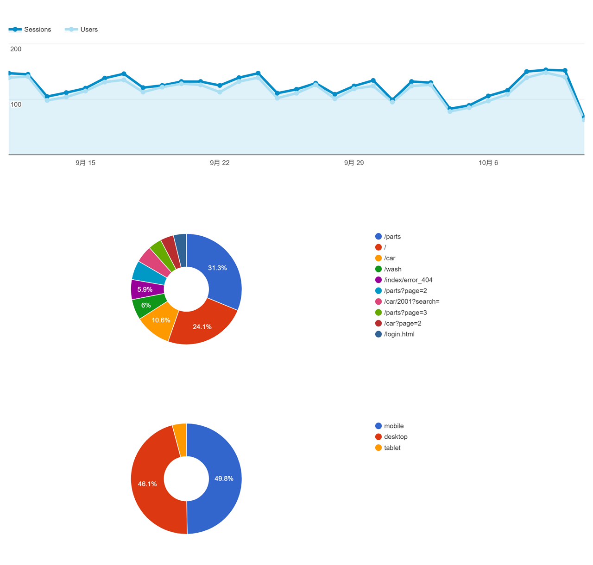
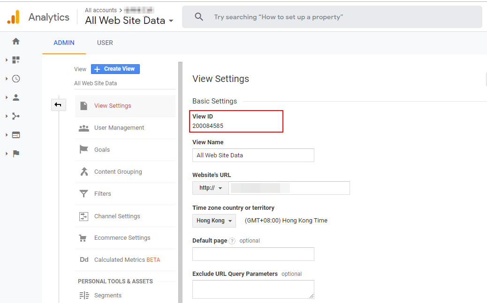

# Laravel google analytics embed dashboard

google analytics embed dashboard for laravel



## Install

```bash
composer require mmhk/laravel-ga-embed
```

## Config

- 配置`ServiceProvider`

  - `config/app.php`
  
```php
<?php
return [
     'providers' => [
        //...
         MMHK\GA\GoogleAnalyticsEmbedServiceProvider::class,
     ],
     
     'aliases' => [
        //...
        'GAEmbed' => MMHK\GA\GAEmbed::class,
     ],
];
```

> 如果是`Laravel 5.5` 以上版本，直接`composer update` 之后会自动发现 `ServiceProvider`

- 发布相关资源文件

```bash
php artisan vendor:publish --provider="MMHK\GA\GoogleAnalyticsEmbedServiceProvider"
```

- 修改配置 `config/ga-embed.php`
```php
<?php
return [
    'config-file' => base_path('resources/key.json'), //此为 Google API Console中下载的json文件
];
```

- 使用
```php
<?= GAEmbed::render($view_id); ?>
```

> `$view_id` 为 google analytics 中 Admin -> Account -> Property -> View -> View Settings 中找到。
> 
> 
## 参考

ref:　https://developers.google.com/analytics/devguides/config/mgmt/v3/quickstart/service-php